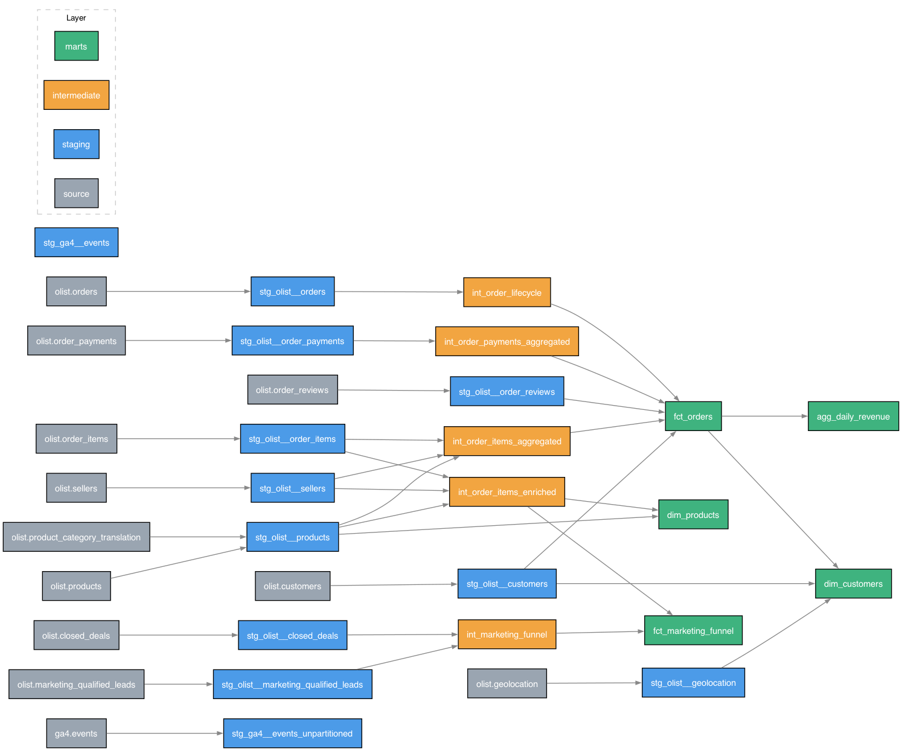

# E-commerce Analytics Warehouse

A dbt + BigQuery analytics warehouse built on the [Olist Brazilian e-commerce](https://www.kaggle.com/datasets/olistbr/brazilian-ecommerce) dataset, with a GA4 events pipeline used to benchmark partitioning and clustering cost. Orchestrated with Airflow.



Sources (grey) → staging (blue) → intermediate (orange) → marts (green). Staging models read only from sources; intermediate models pre-aggregate away one-to-many fan-out before it reaches order/seller grain; marts read staging or intermediate, never a source directly.

## Architecture

- **staging** — one-to-one with source tables: renamed, type-cast, trivial cleaning (trim/case, dedup, blank-to-null). No business logic.
- **intermediate** — grain changes happen here. Order items and payments are many-to-one against an order; these models roll them up to order grain (or enrich at their native grain) before anything downstream joins them, so `fct_orders` never fans out.
- **marts** — `fct_orders` (order grain), `dim_customers` (person grain, via `customer_unique_id` — see below), `dim_products`, `fct_marketing_funnel` (seller-acquisition funnel), and `agg_daily_revenue` (pre-aggregated for dashboards).

One deliberate quirk worth knowing before querying: the source issues a new `customer_id` per **order**, not per person. `customer_unique_id` is the actual person-level key — every lifetime/repeat-purchase metric groups on that column, not `customer_id`.

## Docs

Full column-level documentation and an interactive lineage graph are published via `dbt docs`:

**https://madhumitha282002.github.io/ecommerce-analytics-warehouse/**

Regenerate and stage a new version locally with:

```bash
./scripts/publish_docs.sh
```

Then commit `docs/` and push — GitHub Pages serves it from `main` / `/docs`.

## Orchestration

Airflow DAGs in `orchestration/dags/` run the ingest → dbt build → test → docs pipeline daily. See `orchestration/docker-compose.yaml` for the local dev stack (`docker compose up -d`).

## Stack

dbt-bigquery · BigQuery · Airflow (CeleryExecutor)

## Dashboard

[View Live Dashboard](https://datastudio.google.com/s/mfObv_wG6BQ)

**Note:** This dashboard queries the pre-aggregated `agg_daily_revenue` table 
to minimize BigQuery scan costs. Caching is set to 12 hours. 
Each dashboard load scans ~150KB instead of 47GB if querying raw `fct_orders`.